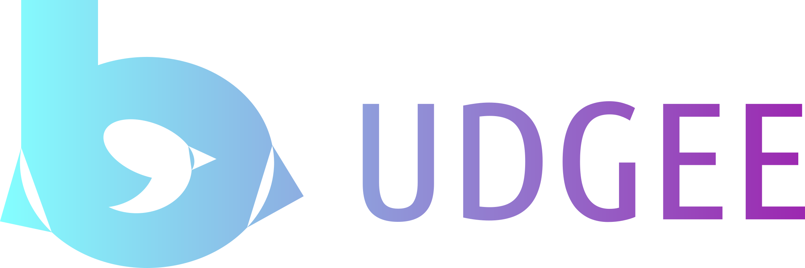

# Budgee
||
|:--:|

[](https://www.codacy.com?utm_source=github.com&amp;utm_medium=referral&amp;utm_content=Davidodari/Budgee&amp;utm_campaign=Badge_Grade)

An android app to help me keep track of financial goals and progress I am making

## Tools Used

1. [Architecture Components](https://developer.android.com/topic/libraries/architecture)
2. [Timber](https://github.com/JakeWharton/timber)
3. [Coroutines](https://kotlinlang.org/docs/reference/coroutines-overview.html)

## License

```
Copyright 2019, David Odari

Licensed under the Apache License, Version 2.0 (the "License");
you may not use this file except in compliance with the License.
You may obtain a copy of the License at

   http://www.apache.org/licenses/LICENSE-2.0

Unless required by applicable law or agreed to in writing, software
distributed under the License is distributed on an "AS IS" BASIS,
WITHOUT WARRANTIES OR CONDITIONS OF ANY KIND, either express or implied.
See the License for the specific language governing permissions and
limitations under the License.
```
